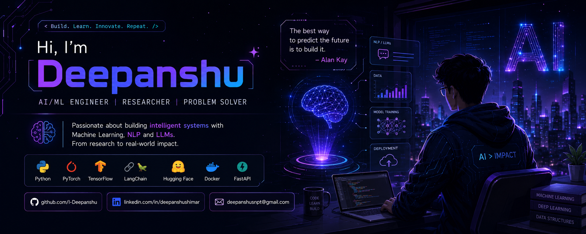

 

  

&nbsp;

&nbsp;

 

&nbsp;

&nbsp;

---

### 🏆 GitHub Trophies

---

<table>
<tr>

<!-- ===== ABOUT ME ===== -->
<td valign="top" width="38%">

### 🤖 About Me

Hi! I'm a **B.Tech CS (AI & ML)** graduate passionate about building production-grade intelligent systems that solve real-world problems.

- 🤖 **ML Engineer** at **Rechk** — BERT paper intelligence (82.4% acc, ROC-AUC 0.946)
- 🛰️ **Research Intern** at **NIT Warangal** — Crop yield ML (LightGBM R²=0.906)
- 🛡️ **ML Intern** at **DRDO** — Toxic gas classifier (XGBoost 95.02%)
- 📄 **Published Researcher** — 2 ML papers
- 🌟 **Microsoft Learn Student Ambassador**
- 🏆 **Top-60 Finalist** — FHIR® Hackathon 2025
- 🥇 **Amazon ML Challenge 2025** — Top 1200 National Rank
- 🎓 UIET, MDU · 2022–2026

</td>

<!-- ===== TECH STACK ===== -->
<td valign="top" width="25%">

### 🛠️ Tech Stack

**Languages**
 

**ML / DL**
 

**NLP & LLMs**
 

**Tools & Cloud**
 

</td>

<!-- ===== GITHUB STATS ===== -->
<td valign="top" width="37%">

### 📊 GitHub Stats

**Streak Stats**

**GitHub Stats**

**Top Languages**

</td>
</tr>
</table>

---

### 📈 Contribution Graph

### 💻 Commit Activity

 

&nbsp;

&nbsp;

---

### 🚀 Featured Projects

<table>
<tr>
<td width="50%" valign="top">

**⚖️ IPC & BNS Predictor — RAG Legal AI**
> `LangChain` `FAISS` `Gemini 3.5 Flash` `HuggingFace`

RAG system mapping FIRs to **500+ IPC / 350+ BNS** sections at **92% accuracy**. Cut manual review by **60%** and response time by **40%**.

</td>
<td width="50%" valign="top">

**📄 Rechk — AI Research Paper Classifier**
> `BERT` `FastAPI` `Docker` `Gemini 3.5 Flash`

End-to-end pipeline: ingestion → BERT quality (Q1–Q4) → grammar correction → plagiarism detection. **82.4% accuracy** on 1,350+ papers.

</td>
</tr>
<tr>
<td width="50%" valign="top">

**🥔 Potato Disease Detection**
> `Swin` `MobileViT` `Grad-CAM` `Streamlit` `FastAPI`

Benchmarked 7 transformer models on 717 leaf images. **97% accuracy** (Swin), **94.86%** (MobileViT, 5.6M params). Grad-CAM interpretability.

</td>
<td width="50%" valign="top">

**🛒 Amazon ML Challenge 2025 — Multimodal Price Prediction**
> `PyTorch` `Qwen3` `DINOv2` `Cross-Attention`

Cross-attention fusion of Qwen3 (text) + DINOv2 (vision). **Top 1200 national rank**, SMAPE 50–52% via 5-fold CV + ensemble stacking.

</td>
</tr>
</table>

---

### 📚 Research Publications

| # | Paper | Venue | |
|---|-------|-------|-|
| 1 | **Solar Panel Degradation Prediction using ML** — Stacked ANN, XGBoost & RF on 480-day UK PV data; best ensemble R² > 0.96 | ResearchSquare |   |
| 2 | **Fuel Cell Degradation Prediction Using ML Models** — Extra Trees Regressor (MAE=0.00099, R²=0.996) on PEM Fuel Cell Dataset | ResearchSquare |   |

---

---

<table>
<tr>
<td align="center" width="33%">

💙 *Thanks for visiting my profile!*

</td>
<td align="center" width="34%">

⚡ *Feel free to connect and collaborate.*

</td>
<td align="center" width="33%">

🚀 *Keep learning, Keep growing.*

</td>
</tr>
</table>

 

